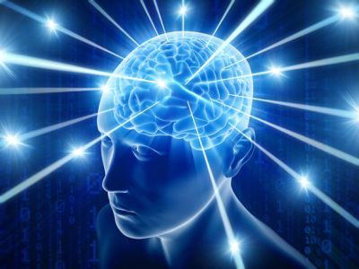

# LERNOMATIC ™ 

## A machine learning library built on Pytorch.

##### What people are saying about *LERNOMATIC*
- *"Its' like a poor-man's fast.ai"* - Heremy Joward
- *"Without Pytorch, this project is nothing"* - Jangqing Yia
- *"This isn't a project that is really on my radar at the moment*" - Deff Jean
- *"I briefly saw this a single time"* - Roseph Jedmon

##### *An artists impression of a typical Lernomatic user in the wild*

## Features 
### Implements things like
- Cyclical learning rate scheduling
- DCGAN
- Variational/Denoising Autoencoders
- Resnets 
- *And so much more![1]*

## Requirements 
- Linux. Tested on Arch and Fedora, but should work on any major distro.
- Should probably work on OSX but not tested.
- Python 3.6
- Pytorch >= 1.0 **Note** tested with Pytorch 1.0.1. I assume later versions will work.
- Developed with a GTX 1080Ti. For many of the models you can get away with less, but for some of the larger GAN experiments having > 8GB memory does help.

## Documentation
See the *docs* folder for documentation about specific *lernomatic™* features.

## Tests
Unit tests are arranged loosely by category. Common stuff is directly in the test/ folder, other sub-folders contain more specific tests.

## Datasets
There are some tools for processing various publicly-available datasets directly.

[1] For the purposes of this document, *so much more* indicates that there is at least 1 *(one)* more feature than is listed in this README
